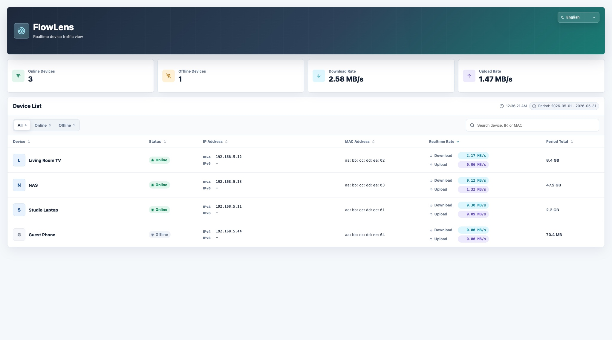

# FlowLens

[简体中文](README.zh-CN.md)

[](https://github.com/BlueSky16st/luci-app-flowlens/actions/workflows/build-package.yml)
[](https://github.com/BlueSky16st/luci-app-flowlens/tags)
[](LICENSE)


FlowLens is a LuCI application for OpenWrt that shows a clean realtime traffic
view of devices on your LAN. It combines device presence, DHCP names, IP
addresses, live throughput, and current `nlbwmon` accounting totals in a React
interface embedded inside LuCI.

The router runtime stays lightweight: FlowLens ships as static LuCI assets plus
a small rpcd shell backend. Node.js, npm, Vite, and React are only needed on a
development machine when rebuilding the frontend bundle.

## Preview



## Features

- LAN device list with name, status, MAC address, IPv4, and IPv6.
- Realtime per-device download and upload rates, displayed as `MB/s`.
- Summary cards for online devices, offline devices, total download rate, and
  total upload rate.
- Current `nlbwmon` accounting period totals and date range.
- Search, online/offline filters, sortable table columns, and responsive mobile
  cards.
- LuCI theme-aware light/dark styling.
- Chinese and English UI modes with an in-page language selector.
- Conservative address selection for cleaner display:
  - IPv4 prefers the current DHCP lease.
  - IPv6 shows one useful address, preferring global addresses, then ULA.
  - Link-local `fe80::` addresses and STALE neighbors are kept out of the main
    display and shown only as history/neighbor cache data.
- Stale offline cleanup: offline devices that are not static DHCP hosts and
  have no observed traffic for `retain_days` are removed from FlowLens'
  short-lived cache. The default retention is 7 days.

## Data Sources

FlowLens reads local OpenWrt data only:

- `/tmp/dhcp.leases` for active DHCP IPv4 leases and host names.
- `/etc/config/dhcp` for static host entries, so configured devices can remain
  visible while offline.
- `/proc/net/arp` and `ip neigh show` for online presence and neighbor cache.
- `conntrack` for second-level live traffic deltas when available.
- `nlbwmon` for current accounting-period traffic counters.
- `/tmp/run/flowlens` for short-lived state used to calculate deltas and keep
  the last main address for offline devices.

FlowLens does not send device data to an external service.

## Requirements

Runtime package dependencies are declared in the package Makefile:

- `nlbwmon`
- `ip-full`

For building packages you need an OpenWrt/ImmortalWrt buildroot or SDK with the
LuCI and packages feeds available.

For frontend development you need Node.js and npm on your development machine.
The router does not need Node.js.

## Configuration

The default UCI config is installed at `/etc/config/flowlens`:

```text
config flowlens 'main'
	option poll_interval '2'
	option retain_days '7'
```

`retain_days` controls cleanup of offline, non-static-DHCP devices that have no
observed traffic. Invalid values, or values lower than 1, fall back to 7 days.

## Installation

If you already have a built package, copy it to the router and install it with
the package manager used by your firmware.

For `opkg` based firmware:

```sh
opkg update
opkg install nlbwmon ip-full
opkg install /tmp/luci-app-flowlens_*.ipk
/etc/init.d/rpcd restart
/etc/init.d/uhttpd restart
```

For `apk` based firmware:

```sh
apk update
apk add nlbwmon ip-full
apk add --allow-untrusted /tmp/luci-app-flowlens-*.apk
/etc/init.d/rpcd restart
/etc/init.d/uhttpd restart
```

Then open LuCI:

```text
Status -> FlowLens
```

If your build is integrated into a firmware image, enable `luci-app-flowlens`
in `make menuconfig`, build the image, flash it, and open the same LuCI menu.

## Build With OpenWrt Buildroot

From the root of an OpenWrt buildroot:

```sh
./scripts/feeds update -a
./scripts/feeds install -a
git clone https://github.com/BlueSky16st/luci-app-flowlens.git package/luci-app-flowlens
make menuconfig
make package/luci-app-flowlens/compile V=s
```

Select `LuCI -> Applications -> luci-app-flowlens` in `make menuconfig` if you
want it included in firmware images.

After compilation, locate the package with:

```sh
find bin/packages -name 'luci-app-flowlens_*'
```

## Build With OpenWrt SDK

The SDK is usually faster when you only need an installable package:

```sh
tar xf openwrt-sdk-*.tar.*
cd openwrt-sdk-*
./scripts/feeds update -a
./scripts/feeds install -a
git clone https://github.com/BlueSky16st/luci-app-flowlens.git package/luci-app-flowlens
make defconfig
make package/luci-app-flowlens/compile V=s
find bin/packages -name 'luci-app-flowlens_*'
```

Use an SDK that matches your router target, OpenWrt version, and package ABI.

## Build On GitHub

The repository includes `.github/workflows/build-package.yml` for release
automation. It validates the frontend/backend and can build package artifacts
from a matching OpenWrt or ImmortalWrt SDK URL.

## Frontend Development

The checked-in LuCI package ships prebuilt assets from:

```text
htdocs/luci-static/resources/flowlens/dist/
```

After changing files under `web/src`, rebuild the static bundle:

```sh
cd web
npm install
npm test
npm run build
```

The build writes:

```text
htdocs/luci-static/resources/flowlens/dist/flowlens-app.js
htdocs/luci-static/resources/flowlens/dist/flowlens-app.css
```

When the frontend bundle changes, also bump the matching cache-busting version
in:

- `web/src/main.jsx`
- `htdocs/luci-static/resources/view/flowlens/overview.js`

For local browser preview:

```sh
cd web
npm run dev
```

## Tests

Frontend unit tests:

```sh
cd web
npm test
```

Frontend production build:

```sh
cd web
npm run build
```

Backend contract and syntax checks:

```sh
tests/test_rpc_devices.sh
sh -n root/usr/libexec/rpcd/luci.flowlens
node --check htdocs/luci-static/resources/view/flowlens/overview.js
```

## Development Install On A Router

For quick iteration on a live router, copy the changed files to the matching
absolute paths:

```text
/usr/libexec/rpcd/luci.flowlens
/www/luci-static/resources/view/flowlens/overview.js
/www/luci-static/resources/flowlens/dist/flowlens-app.js
/www/luci-static/resources/flowlens/dist/flowlens-app.css
```

Then restart services:

```sh
/etc/init.d/rpcd restart
/etc/init.d/uhttpd restart
```

If browser caching gets in the way during development, append a version query
parameter to the LuCI URL, for example:

```text
/cgi-bin/luci/admin/status/flowlens?flowlens_v=0.1.27
```

## Repository Layout

```text
.
├── Makefile
├── README.md
├── README.zh-CN.md
├── docs/
│   ├── preview.jpg
│   └── preview-en.jpg
├── htdocs/
│   └── luci-static/resources/
│       ├── flowlens/dist/          # built React assets shipped with LuCI
│       └── view/flowlens/          # LuCI view entrypoint
├── root/
│   ├── etc/config/flowlens         # default UCI config
│   └── usr/
│       ├── libexec/rpcd/           # rpcd backend script
│       └── share/
│           ├── luci/menu.d/        # LuCI menu entry
│           └── rpcd/acl.d/         # ubus ACL
├── tests/                          # backend contract tests
└── web/                            # React/Vite source and frontend tests
```

## Contributing

Contributions are welcome. Please keep changes focused and easy to review.

- Keep router-side scripts POSIX shell and BusyBox awk compatible.
- Do not add Node.js or Python runtime dependencies to the router side.
- Rebuild `web/src` changes and commit the generated LuCI assets.
- Bump the frontend cache version when the bundle changes.
- Update both `README.md` and `README.zh-CN.md` for user-facing behavior,
  installation, or build changes.
- Avoid publishing private LAN details in screenshots, issues, or examples.

Before opening a pull request, run the relevant tests listed above.

## Notes

- On the first refresh, realtime rates may show `0.00 MB/s` until FlowLens has
  enough samples to calculate a delta.
- `nlbwmon` totals reflect the current accounting database period, not all-time
  device traffic.
- Device names are treated as user data. Only the generated unknown-device
  fallback label is translated by the UI.

## License

MIT
