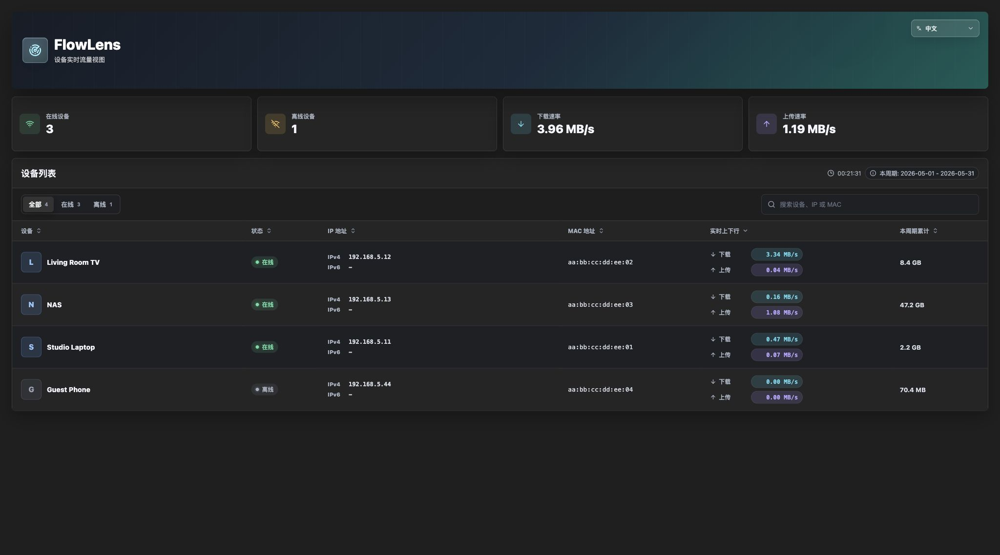

# FlowLens

[English](README.md)

[](https://github.com/BlueSky16st/luci-app-flowlens/actions/workflows/build-package.yml)
[](https://github.com/BlueSky16st/luci-app-flowlens/tags)
[](LICENSE)


FlowLens 是一个用于 OpenWrt 的 LuCI 应用，用来展示局域网设备的实时流量视图。它会把设备在线状态、DHCP 名称、IP 地址、实时上下行速率，以及当前 `nlbwmon` 统计周期累计流量整合到 LuCI 内的 React 界面中。

路由器运行时保持轻量：FlowLens 只发布静态 LuCI 资源和一个小型 rpcd shell 后端。Node.js、npm、Vite、React 只在开发机重新构建前端 bundle 时需要，路由器上不需要安装这些工具。

## 预览



## 功能

- 局域网设备列表，包含设备名、在线状态、MAC 地址、IPv4 和 IPv6。
- 每台设备实时下载/上传速率，固定以 `MB/s` 显示。
- 在线设备、离线设备、总下载速率、总上传速率汇总卡片。
- 当前 `nlbwmon` 统计周期累计值和日期范围。
- 搜索、在线/离线筛选、表头排序、移动端响应式卡片布局。
- 适配 LuCI 深色/浅色主题。
- 支持中文和英文界面，并可在页面内通过语言下拉框切换。
- 更克制的地址选择策略：
  - IPv4 主显示优先使用当前 DHCP 租约。
  - IPv6 主显示只展示一个最有用地址，优先公网地址，其次 ULA。
  - `fe80::` 链路本地地址和 STALE neighbor 不进入主显示，只作为历史/邻居缓存展示。
- 离线陈旧设备清理：如果设备离线、不是静态 DHCP host，并且连续
  `retain_days` 没有观察到流量，会从 FlowLens 的短生命周期缓存中移除。
  默认保留 7 天。

## 数据来源

FlowLens 只读取 OpenWrt 本机数据：

- `/tmp/dhcp.leases`：当前 DHCP IPv4 租约和设备名。
- `/etc/config/dhcp`：静态 host 配置，用来让已配置设备离线时仍可保留。
- `/proc/net/arp` 与 `ip neigh show`：在线状态与邻居缓存。
- `conntrack`：可用时用于计算秒级实时流量差值。
- `nlbwmon`：当前统计周期的流量计数。
- `/tmp/run/flowlens`：短生命周期状态，用来计算速率差值，并记住离线设备最后主地址。

FlowLens 不会把设备数据发送到外部服务。

## 依赖

运行时依赖已经在包 Makefile 中声明：

- `nlbwmon`
- `ip-full`

构建安装包需要 OpenWrt/ImmortalWrt buildroot 或 SDK，并且可用 LuCI 和 packages feeds。

前端开发需要在开发机上安装 Node.js 和 npm。路由器运行时不需要 Node.js。

## 配置

默认 UCI 配置会安装到 `/etc/config/flowlens`：

```text
config flowlens 'main'
	option poll_interval '2'
	option retain_days '7'
```

`retain_days` 用来控制离线、非静态 DHCP、且没有观察到流量的陈旧设备清理。
小于 1 或无效的值会回退为 7 天。

## 安装

如果已经有构建好的安装包，可以复制到路由器后使用固件对应的包管理器安装。

`opkg` 固件：

```sh
opkg update
opkg install nlbwmon ip-full
opkg install /tmp/luci-app-flowlens_*.ipk
/etc/init.d/rpcd restart
/etc/init.d/uhttpd restart
```

`apk` 固件：

```sh
apk update
apk add nlbwmon ip-full
apk add --allow-untrusted /tmp/luci-app-flowlens-*.apk
/etc/init.d/rpcd restart
/etc/init.d/uhttpd restart
```

然后打开 LuCI：

```text
状态 -> FlowLens
```

如果已经集成到固件镜像中，在 `make menuconfig` 中启用
`luci-app-flowlens`，构建并刷入固件后，打开同一个 LuCI 菜单即可。

## 使用 OpenWrt Buildroot 构建

在 OpenWrt buildroot 根目录下执行：

```sh
./scripts/feeds update -a
./scripts/feeds install -a
git clone https://github.com/BlueSky16st/luci-app-flowlens.git package/luci-app-flowlens
make menuconfig
make package/luci-app-flowlens/compile V=s
```

如果要把 FlowLens 编入固件镜像，可以在 `make menuconfig` 中选择
`LuCI -> Applications -> luci-app-flowlens`。

编译完成后可以这样查找安装包：

```sh
find bin/packages -name 'luci-app-flowlens_*'
```

## 使用 OpenWrt SDK 构建

如果只是想构建可安装包，SDK 通常更轻量：

```sh
tar xf openwrt-sdk-*.tar.*
cd openwrt-sdk-*
./scripts/feeds update -a
./scripts/feeds install -a
git clone https://github.com/BlueSky16st/luci-app-flowlens.git package/luci-app-flowlens
make defconfig
make package/luci-app-flowlens/compile V=s
find bin/packages -name 'luci-app-flowlens_*'
```

SDK 需要与路由器目标平台、OpenWrt 版本和包 ABI 匹配。

## 在 GitHub 上构建

仓库包含 `.github/workflows/build-package.yml`，用于发布包的自动化构建。
它会校验前端/后端，并可基于匹配的 OpenWrt 或 ImmortalWrt SDK URL 构建包产物。

## 前端开发

LuCI 包会直接携带以下构建产物：

```text
htdocs/luci-static/resources/flowlens/dist/
```

修改 `web/src` 下的前端源码后，需要重新构建静态 bundle：

```sh
cd web
npm install
npm test
npm run build
```

构建会写入：

```text
htdocs/luci-static/resources/flowlens/dist/flowlens-app.js
htdocs/luci-static/resources/flowlens/dist/flowlens-app.css
```

如果修改了前端 bundle，也要同步提升缓存版本号：

- `web/src/main.jsx`
- `htdocs/luci-static/resources/view/flowlens/overview.js`

本地浏览器预览：

```sh
cd web
npm run dev
```

## 测试

前端单元测试：

```sh
cd web
npm test
```

前端生产构建：

```sh
cd web
npm run build
```

后端契约测试和语法检查：

```sh
tests/test_rpc_devices.sh
sh -n root/usr/libexec/rpcd/luci.flowlens
node --check htdocs/luci-static/resources/view/flowlens/overview.js
```

## 开发环境安装到路由器

如果要在真实路由器上快速调试，可以把改动文件复制到对应绝对路径：

```text
/usr/libexec/rpcd/luci.flowlens
/www/luci-static/resources/view/flowlens/overview.js
/www/luci-static/resources/flowlens/dist/flowlens-app.js
/www/luci-static/resources/flowlens/dist/flowlens-app.css
```

然后重启服务：

```sh
/etc/init.d/rpcd restart
/etc/init.d/uhttpd restart
```

开发时如果遇到浏览器缓存，可以在 LuCI URL 后追加版本参数，例如：

```text
/cgi-bin/luci/admin/status/flowlens?flowlens_v=0.1.27
```

## 目录结构

```text
.
├── Makefile
├── README.md
├── README.zh-CN.md
├── docs/
│   ├── preview.jpg
│   └── preview-en.jpg
├── htdocs/
│   └── luci-static/resources/
│       ├── flowlens/dist/          # 随 LuCI 发布的前端构建产物
│       └── view/flowlens/          # LuCI view 入口
├── root/
│   ├── etc/config/flowlens         # 默认 UCI 配置
│   └── usr/
│       ├── libexec/rpcd/           # rpcd 后端脚本
│       └── share/
│           ├── luci/menu.d/        # LuCI 菜单入口
│           └── rpcd/acl.d/         # ubus ACL
├── tests/                          # 后端契约测试
└── web/                            # React/Vite 源码和前端测试
```

## 贡献

欢迎贡献代码。请尽量保持改动聚焦，方便 review。

- 路由器侧脚本需要兼容 POSIX shell 与 BusyBox awk。
- 不要给路由器运行时新增 Node.js 或 Python 依赖。
- 修改 `web/src` 后需要重新构建，并提交生成的 LuCI 静态资源。
- 前端 bundle 变化时需要同步提升缓存版本号。
- 用户可见行为、安装方式、构建方式变化时，请同时维护
  `README.md` 和 `README.zh-CN.md`。
- 不要在截图、issue 或示例中发布私人局域网设备名、IP、MAC 等信息。

提交 Pull Request 前，请运行上面列出的相关测试。

## 注意事项

- 第一次刷新时，实时速率可能显示 `0.00 MB/s`，需要至少两次采样后才能计算差值。
- `nlbwmon` 累计值来自当前数据库统计周期，不是设备历史总流量。
- 设备名会被视为用户数据，不会被翻译；只有应用生成的未知设备占位名会随语言切换。

## 许可证

MIT
