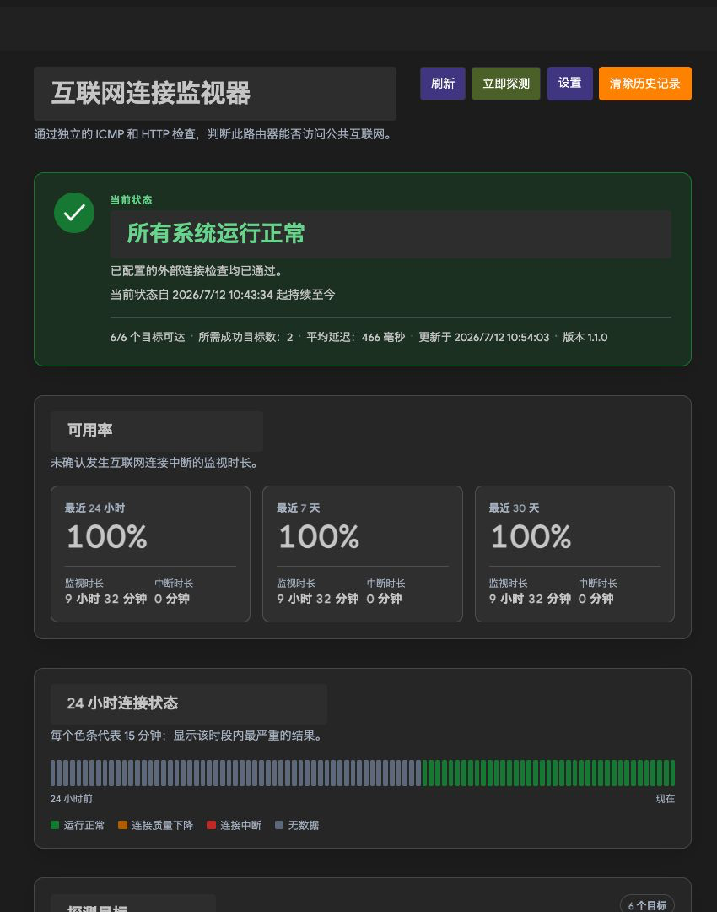
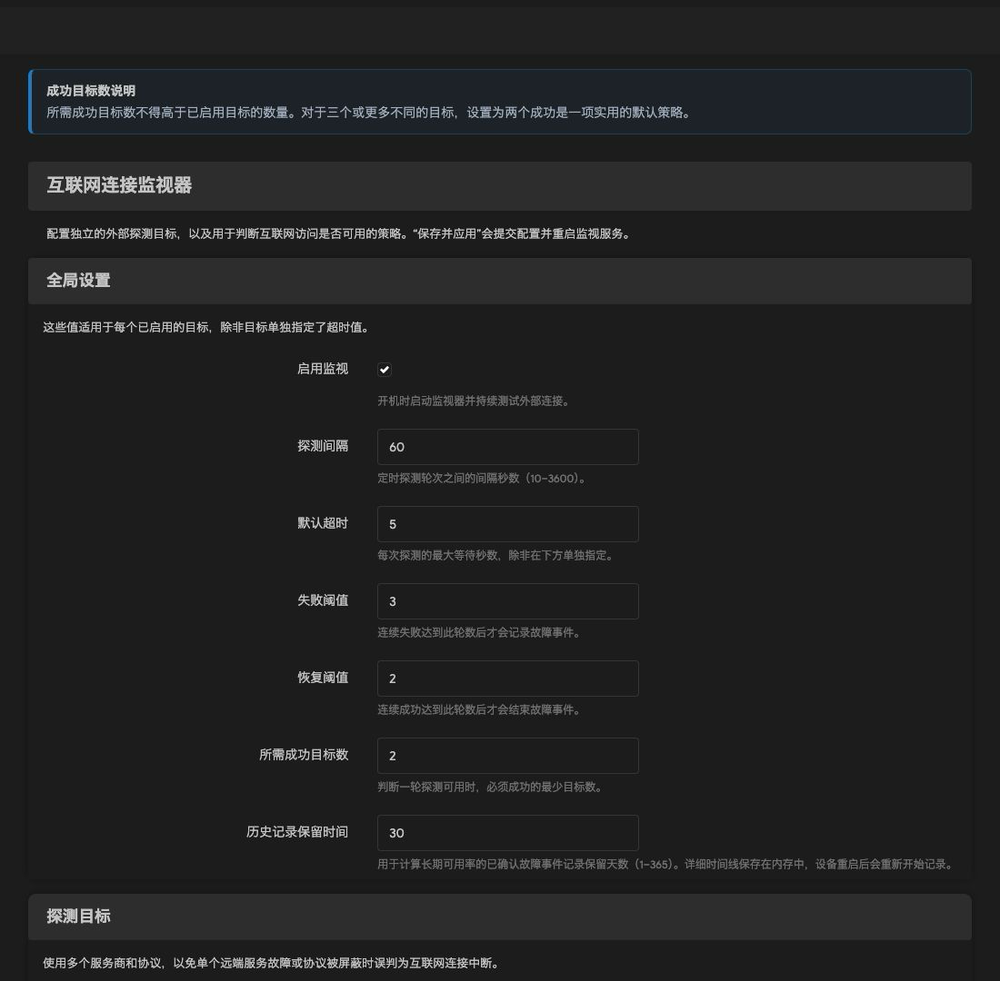

# luci-app-monitor

简体中文 | [English](README_en.md)

面向 OpenWrt 的公网连接状态监控 LuCI 应用。它使用多个独立的 ICMP/HTTP 探测目标判断路由器是否仍能访问公网，并以类似 Cloudflare Status 的页面展示当前状态、24 小时时间线、24 小时/7 天/30 天可用率、目标延迟和中断事件。

## LuCI 菜单位置

安装后入口固定在 **“状态 → 互联网连接”**，其中包含“概览”和“设置”两个页面；本应用不会出现在“服务”菜单中。

## 界面截图

以下截图采集自实际运行本应用的 OpenWrt 生产设备。

### 概览



### 设置



## 功能

- 多目标、多运营方、多协议探测，避免单个远端故障造成误报
- 法定数（quorum）判定；区分正常、性能下降、确认中断和无数据
- 连续失败/恢复阈值，抑制瞬时丢包造成的状态抖动
- IPv4、IPv6 或自动地址族，可为每个目标设置超时
- HTTP 状态码或状态码范围校验
- Cloudflare Status 风格的响应式 LuCI 页面，支持暗色主题
- 当前开机后的细粒度状态与延迟采样保存在 RAM；重启前的可用、中断和无数据区间由持久事件回填，兼顾时间线连续性与低闪存写入
- 仅持久化可用性类别边界（可用、确认中断、无数据）；事件先写 RAM 日志，再按 15 分钟批量落盘，用于时间线回填和 7/30 天可用率，避免高频写闪存
- procd 守护、rpcd 最小权限 ACL、UCI 配置和 sysupgrade 数据保留
- 纯 JavaScript/POSIX ash，无架构相关二进制；一个 `all/noarch` 包覆盖所有 OpenWrt CPU 架构

## 支持矩阵

| OpenWrt | 状态 | 包格式 | 架构元数据 |
|---|---|---|---|
| 23.05.6 | 兼容构建；该系列已 EOL | `.ipk` | `all` |
| 24.10.7 | 兼容构建 | `.ipk` | `all` |
| 25.12.5 | 当前稳定系列 | `.apk` | `noarch` |

发布包使用各系列最新补丁版官方 SDK 验证。由于包内没有 ELF/native 文件，`all/noarch` 产物可安装到 x86_64、aarch64、arm、mips/mipsel 等该 OpenWrt 系列支持的目标。若将来加入原生程序，则必须拆分为对应 `arch_packages` 的架构包。

## 默认判定策略

默认启用六个跨国内外服务商的探测：

1. Cloudflare `1.1.1.1` ICMP
2. AliDNS `223.5.5.5` ICMP
3. AliDNS `https://dns.alidns.com/dns-query?...` HTTPS
4. DNSPod `https://doh.pub/dns-query?...` HTTPS
5. `https://openwrt.org/` HTTPS
6. Cloudflare `https://1.1.1.1/cdn-cgi/trace` HTTPS

每轮至少 2 个目标成功即达到法定数。连续 3 轮低于法定数才确认中断，连续 2 轮恢复才关闭中断。另附一个默认关闭的 Cloudflare IPv6 探测目标，可在设置页启用。

“性能下降”表示仍有公网可达性，但并非全部目标成功；只有低于法定数并经过失败阈值确认后才计入停机时间。

## 安装

从 Release 下载与系统系列匹配的产物，不要根据 CPU 名称选择包——本项目是架构无关包。

OpenWrt 23.05/24.10：

```sh
# 24.10；23.05 的文件名为 1.1.1_all.ipk（不带 -r1）
scp luci-app-monitor_1.1.1-r1_all.ipk \
  luci-i18n-monitor-zh-cn_1.1.1-r1_all.ipk root@192.168.1.1:/tmp/
ssh root@192.168.1.1 \
  'opkg install /tmp/luci-app-monitor_1.1.1-r1_all.ipk /tmp/luci-i18n-monitor-zh-cn_1.1.1-r1_all.ipk'
```

OpenWrt 25.12：

```sh
scp luci-app-monitor-1.1.1-r1.apk \
  luci-i18n-monitor-zh-cn-1.1.1-r1.apk root@192.168.1.1:/tmp/
ssh root@192.168.1.1 \
  'apk add --allow-untrusted /tmp/luci-app-monitor-1.1.1-r1.apk /tmp/luci-i18n-monitor-zh-cn-1.1.1-r1.apk'
```

主包安装脚本会启用并启动 `internet-monitor`；`luci-i18n-monitor-zh-cn` 提供简体中文界面。登录 LuCI 后打开“状态 → 互联网连接”。

## 配置

可在 LuCI 设置页管理，也可直接编辑 `/etc/config/internet-monitor`：

```uci
config global 'global'
	option enabled '1'
	option interval '60'
	option timeout '5'
	option failure_threshold '3'
	option recovery_threshold '2'
	option quorum '2'
	option history_days '30'

config target 'example'
	option enabled '1'
	option name 'Example HTTPS'
	option type 'http'
	option address 'https://example.com/'
	option family 'auto'
	option timeout '5'
	option expected_codes '200-399'
```

应用配置后服务会自动重启。常用诊断命令：

每轮最多执行 64 个已启用目标，以保证低配置路由器上的资源上限。如超出此限制，状态页会明确显示未探测的目标数；未探测目标不参与本轮法定数计算。

```sh
/etc/init.d/internet-monitor status
logread -e internet-monitor
ubus call luci.internet-monitor getStatus
ubus call luci.internet-monitor getHistory '{"hours":24}'
```

## 数据与闪存写入

- `/tmp/internet-monitor/`：当前结果与细粒度状态/延迟采样，位于 RAM，重启后重新开始；重启前的时间线由持久事件回填，但不会伪造精确延迟或短暂性能下降
- `/etc/internet-monitor/`：首次监测时间，以及可用、确认中断和无数据边界；RAM 事件日志每 15 分钟或服务正常停止时批量落盘，持久事件另有 10000 行硬上限
- `/etc/config/internet-monitor`：UCI 配置，作为 conffile 在升级时保留

`/etc/internet-monitor/` 已加入 sysupgrade 保留清单。卸载软件包不会主动删除历史；如需删除，可先在页面使用“清除历史”，或手工删除该目录。

## 本地测试

```sh
python3 -m unittest discover -s tests -v
sh -n root/etc/init.d/internet-monitor \
  root/usr/libexec/internet-monitor/daemon \
  root/usr/libexec/rpcd/luci.internet-monitor
```

测试覆盖资源/ACL、Shell 语法、默认配置、多目标法定数，以及失败和恢复状态机。Release 构建还会分别使用三个官方 SDK 校验 IPK/APK 格式、架构、依赖与无 native payload。

## 构建发行包

需要 Docker：

```sh
./scripts/build-openwrt-packages.sh
```

也可以只构建某个系列：

```sh
./scripts/build-openwrt-packages.sh 24.10.7
```

SDK 下载和构建缓存默认位于 `/tmp/luci-app-monitor-openwrt-sdk`，最终产物位于仓库的 `dist/` 目录。SDK 文件使用固定 SHA256 校验；构建脚本会拒绝版本/格式/数量不符合预期的输出。

## 安全设计

- LuCI ACL 只开放 4 个固定的自定义 ubus 方法，不开放任意命令执行或文件通配访问
- 服务仅把 UCI 字段作为已引用的命令参数使用，不使用 `eval` 执行用户配置
- 探测类型、地址族、超时和 HTTP 状态码规则均经过白名单/范围校验
- rpcd 输出通过 `jshn` 编码，页面通过 LuCI DOM 构造器渲染诊断文本
- HTTP 探测使用系统 CA 验证；不使用 `-k/--insecure`

## 许可证

MIT，见 [LICENSE](LICENSE)。
