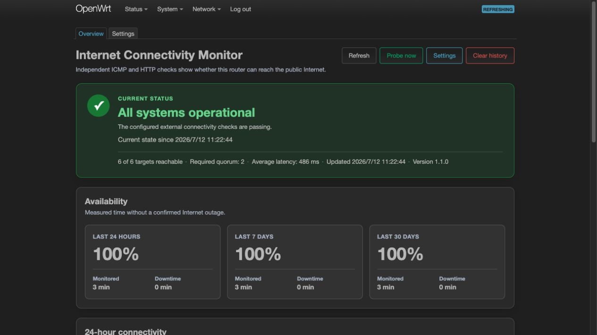
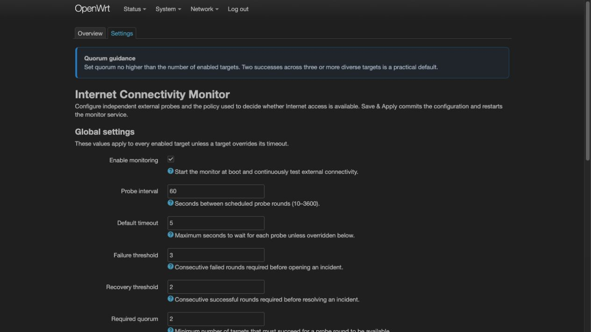

# luci-app-monitor

[简体中文](README.md) | English

A LuCI application for monitoring Internet connectivity on OpenWrt. It checks multiple independent ICMP and HTTP targets to determine whether the router can still reach the Internet, and presents the current status, a 24-hour timeline, 24-hour/7-day/30-day availability, target latency, and outage events in a Cloudflare Status-inspired interface.

## LuCI Menu Location

After installation, the application is available at **Status → Internet Connectivity**, with separate Overview and Settings pages. It does not appear in the Services menu.

## Language Support

English is the built-in source language and requires no additional language package. Simplified Chinese is provided separately by the optional `luci-i18n-monitor-zh-cn` package.

## Screenshots

The screenshots below were captured from the main package running in an English-language OpenWrt 24.10.7 Docker environment. The Simplified Chinese translation package was not installed.

### Overview



### Settings



## Features

- Multi-target, multi-provider, and multi-protocol probes to avoid false alarms caused by a single remote service failure
- Quorum-based decisions that distinguish operational, degraded, confirmed outage, and no-data states
- Consecutive failure and recovery thresholds to suppress status flapping caused by transient packet loss
- IPv4, IPv6, or automatic address-family selection, with per-target timeouts
- HTTP status code and status code range validation
- Responsive Cloudflare Status-inspired LuCI interface with dark-theme support
- Fine-grained state and latency samples from the current boot are stored in RAM; persisted availability, outage, and no-data boundaries backfill the pre-reboot timeline without frequent flash writes
- Only availability-class boundaries (available, confirmed outage, and no data) are persisted; events are first written to a RAM log and then flushed in 15-minute batches for timeline backfill and 7-day/30-day availability calculations
- procd supervision, minimal rpcd ACLs, UCI configuration, and sysupgrade data retention
- Pure JavaScript and POSIX ash implementation with no architecture-specific binaries; one `all/noarch` package supports every OpenWrt CPU architecture

## Compatibility Matrix

| OpenWrt | Status | Package format | Architecture metadata |
|---|---|---|---|
| 23.05.6 | Compatibility build; this series is EOL | `.ipk` | `all` |
| 24.10.7 | Compatibility build | `.ipk` | `all` |
| 25.12.5 | Current stable series | `.apk` | `noarch` |

Release packages are validated with the latest official SDK patch release from each series. Because the packages contain no ELF or native files, the `all/noarch` artifacts can be installed on x86_64, aarch64, ARM, MIPS, MIPSel, and other targets supported by the corresponding OpenWrt series. If native programs are added in the future, separate packages will be required for each `arch_packages` architecture.

## Default Decision Policy

Six probe targets across domestic and international providers are enabled by default:

1. Cloudflare `1.1.1.1` ICMP
2. AliDNS `223.5.5.5` ICMP
3. AliDNS `https://dns.alidns.com/dns-query?...` HTTPS
4. DNSPod `https://doh.pub/dns-query?...` HTTPS
5. `https://openwrt.org/` HTTPS
6. Cloudflare `https://1.1.1.1/cdn-cgi/trace` HTTPS

At least two successful targets are required to meet quorum in each probe cycle. An outage is confirmed only after three consecutive cycles below quorum, and the outage is closed after two consecutive recovery cycles. An additional Cloudflare IPv6 probe target is included but disabled by default; it can be enabled on the Settings page.

A degraded state means that Internet access is still available, but not all targets succeeded. Downtime is counted only after the result falls below quorum and passes the configured failure threshold.

## Installation

Download the artifacts matching your OpenWrt series from the Releases page. Do not select packages based on CPU architecture—the project is architecture-independent.

OpenWrt 23.05/24.10:

```sh
# For 24.10; the 23.05 filename is 1.1.1_all.ipk without -r1
scp luci-app-monitor_1.1.1-r1_all.ipk \
  luci-i18n-monitor-zh-cn_1.1.1-r1_all.ipk root@192.168.1.1:/tmp/
ssh root@192.168.1.1 \
  'opkg install /tmp/luci-app-monitor_1.1.1-r1_all.ipk /tmp/luci-i18n-monitor-zh-cn_1.1.1-r1_all.ipk'
```

OpenWrt 25.12:

```sh
scp luci-app-monitor-1.1.1-r1.apk \
  luci-i18n-monitor-zh-cn-1.1.1-r1.apk root@192.168.1.1:/tmp/
ssh root@192.168.1.1 \
  'apk add --allow-untrusted /tmp/luci-app-monitor-1.1.1-r1.apk /tmp/luci-i18n-monitor-zh-cn-1.1.1-r1.apk'
```

The main package installation script enables and starts `internet-monitor`. The `luci-i18n-monitor-zh-cn` package provides the Simplified Chinese interface. After signing in to LuCI, open **Status → Internet Connectivity**.

## Configuration

Targets can be managed on the LuCI Settings page or by editing `/etc/config/internet-monitor` directly:

```uci
config global 'global'
	option enabled '1'
	option interval '60'
	option timeout '5'
	option failure_threshold '3'
	option recovery_threshold '2'
	option quorum '2'
	option history_days '30'

config target 'example'
	option enabled '1'
	option name 'Example HTTPS'
	option type 'http'
	option address 'https://example.com/'
	option family 'auto'
	option timeout '5'
	option expected_codes '200-399'
```

The service restarts automatically after configuration changes are applied.

At most 64 enabled targets are executed in each probe cycle to maintain a predictable resource ceiling on low-end routers. If this limit is exceeded, the status page clearly shows the number of targets that were not probed. Unprobed targets do not participate in the quorum calculation for that cycle.

Common diagnostic commands:

```sh
/etc/init.d/internet-monitor status
logread -e internet-monitor
ubus call luci.internet-monitor getStatus
ubus call luci.internet-monitor getHistory '{"hours":24}'
```

## Data and Flash Writes

- `/tmp/internet-monitor/`: current results and fine-grained state/latency samples stored in RAM; samples restart after a reboot, while persisted events backfill the earlier timeline without inventing exact latency or short-lived degradation
- `/etc/internet-monitor/`: first observation time plus availability, confirmed outage, and no-data boundaries; the RAM event log is persisted every 15 minutes or during a clean service shutdown, with a hard limit of 10,000 persistent event lines
- `/etc/config/internet-monitor`: UCI configuration retained as a conffile during upgrades

`/etc/internet-monitor/` is included in the sysupgrade retention list. Uninstalling the package does not automatically delete its history. To remove it, use Clear History in the interface first or delete the directory manually.

## Local Testing

```sh
python3 -m unittest discover -s tests -v
sh -n root/etc/init.d/internet-monitor \
  root/usr/libexec/internet-monitor/daemon \
  root/usr/libexec/rpcd/luci.internet-monitor
```

Tests cover resources and ACLs, shell syntax, default configuration, multi-target quorum behavior, and the failure/recovery state machine. Release builds also use three official SDKs to validate IPK/APK format, architecture metadata, dependencies, and the absence of native payloads.

## Building Release Packages

Docker is required:

```sh
./scripts/build-openwrt-packages.sh
```

To build only one OpenWrt series:

```sh
./scripts/build-openwrt-packages.sh 24.10.7
```

SDK downloads and build caches are stored in `/tmp/luci-app-monitor-openwrt-sdk` by default. Final artifacts are written to the repository's `dist/` directory. SDK files are verified against pinned SHA-256 checksums, and the build script rejects output with unexpected versions, formats, or artifact counts.

## Security Design

- The LuCI ACL exposes only four fixed custom ubus methods, with no arbitrary command execution or filesystem wildcard access
- UCI fields are passed only as quoted command arguments; the service never executes user configuration with `eval`
- Probe type, address family, timeout, and HTTP status code rules are validated against allowlists and numeric ranges
- rpcd output is encoded with `jshn`, and the interface renders diagnostic text through LuCI DOM constructors
- HTTP probes use the system CA trust store and never use `-k` or `--insecure`

## License

MIT. See [LICENSE](LICENSE).
