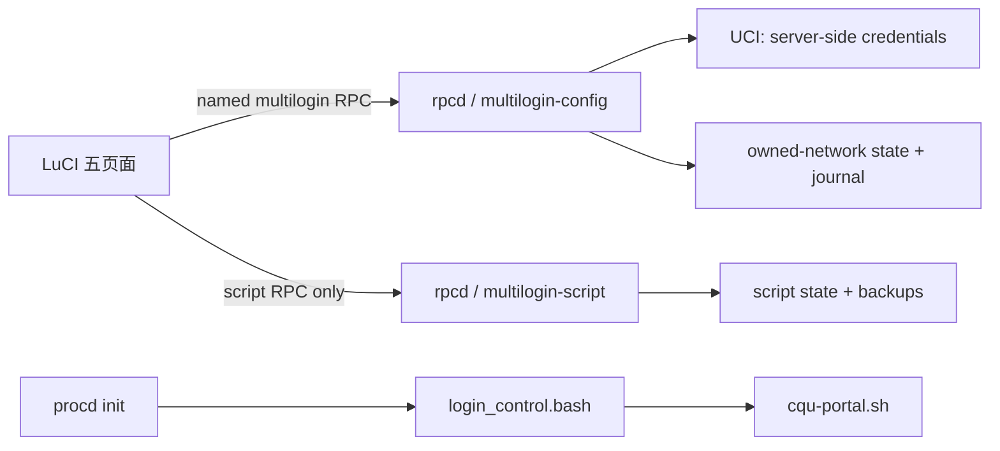

# MultiLogin v3 项目总览

## 架构

v3 是一个以固定 RPC 边界为中心的 OpenWrt LuCI 应用。前端、后台、控制器、门户脚本和网络事务各自拥有明确职责：



| 部件 | 责任 | 不负责 |
| --- | --- | --- |
| LuCI | 呈现状态，调用固定 RPC，显示可恢复的加载/空/错误状态 | 读取 UCI、文件、日志，执行任意命令或服务操作 |
| `multilogin-config` | 设置、账户、实例、服务动作、脱敏诊断、受管网络事务 | 任意 UCI 包、任意路径或前缀式资源清理 |
| `multilogin-script` | 固定 Raw 更新与 Custom 草稿的状态机、验证/激活恢复 | 更新 IPK、控制器、LuCI 或任何其他文件 |
| `login_control.bash` | 逐实例调度、退避、抖动和调用门户脚本 | 通过 argv、日志或临时路径暴露凭据 |
| `cqu-portal.sh` | 门户状态、登录、注销、版本与离线自检 | 管理服务、网络或 LuCI |

## 代码布局

```text
htdocs/luci-static/resources/view/multilogin/
  overview.js        # 摘要与恢复提醒
  configuration.js   # 设置、账户、实例、显式服务应用
  network.js         # 精确拥有的网络资源与恢复
  scripts.js         # Phase 6 托管/自定义脚本管理器
  diagnostics.js     # 有界脱敏日志与环境摘要
root/usr/share/luci/menu.d/
  luci-app-multi-login.json
root/usr/libexec/
  multilogin-config  # Phase 7 固定配置/网络/诊断 RPC
  multilogin-script  # Phase 5 固定脚本 RPC
etc/multilogin/
  login_control.bash
  cqu-portal.sh
```

实际安装路径、文件模式和完整状态模式以 [v3 合同](docs/v3/contracts.md) 为准。

## 产品导航

LuCI 只公开五个一级页面：**概览、配置、网络、脚本、诊断**。旧 `settings`、`accounts`、`interfaces`、`script` 和 `log` 地址为隐藏别名，转入新页面而不加载旧实现。

所有页面都有原生 LuCI 的加载、空、错误和重试状态。操作按钮在请求进行时禁用，确认弹窗保护删除、登录/注销测试、服务变更、网络事务和脚本激活等有副作用的动作。布局使用可换行操作区和可滚动表格容器，避免窄屏页面横向溢出。

## 数据与安全

账户密码只在服务器端保存。浏览器收到的是 `password_set` 布尔值，而非掩码或秘密字符串；更新既有账户时，空密码表示保持原值。门户脚本从标准输入接收凭据，动作响应与诊断日志均只包含允许的、已脱敏的分类信息。

脚本状态与网络所有权状态均为 root-only 文件，并通过代次、锁、原子写入和事务日志保护。脚本的自定义草稿是管理员输入的 root 级代码，不应包含任何秘密；活动、工厂、候选和备份脚本内容均不由浏览器读取。

网络页只管理 `network-state.json` 精确记录的 `ml3_*` 资源。事务会在网络、防火墙、mwan3 变更前写入 before/after 日志；恢复只能按固定状态归约执行。未记录资源（包含旧 `auto_*` 对象）绝不会被自动认领或删除。

## 服务与运行流程

配置保存与运行时服务变更分离。保存设置、账户或实例仅更改经验证的配置；页面随后通过固定 `service_action` 显式启动、停止、重启、启用或禁用 MultiLogin 服务。

运行时，控制器读取服务器端配置，为每个启用实例维护独立退避状态，并在 mwan3 接口离线时调用统一门户脚本。门户结果是机器可读的单个 JSON 信封；控制器依据可信状态、退出码和结果类别调度下一次尝试。

## 验证边界

v3 的主机侧验证只覆盖编译、静态检查、纯逻辑、脱敏序列化和狭窄的秘密边界。它不模拟 OpenWrt、UCI、procd、网络、防火墙、mwan3、重启或门户行为。真实设备安装/升级、网络事务、认证、脚本执行与恢复属于 Phase 9，需要明确授权后按设备验收矩阵完成。
