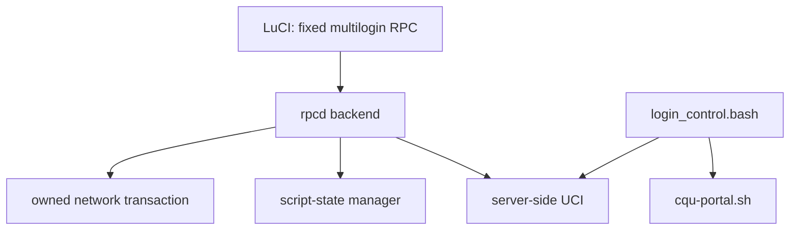

# LuCI App MultiLogin

面向 OpenWrt 23.05+ 与 mwan3 的多接口校园网认证管理工具。v3 使用 LuCI JavaScript 与固定 `multilogin` rpcd 接口；浏览器不会直接读取 UCI、脚本文件、日志文件或 init 服务对象。

## 功能

- 管理多个账户与登录实例，账户可由实例引用，密码始终只写。
- 由 `login_control.bash` 负责每个实例的状态检查、指数退避与调度。
- 由统一的 `cqu-portal.sh` 负责 `status`、`login`、`logout`、版本与离线自检。
- 通过受管脚本流程检查、暂存、验证、显式激活、回滚或恢复出厂脚本。
- 通过精确所有权记录创建和删除 `ml3_*` 网络资源；不会按名称前缀删除用户资源。
- 提供有界、服务器端脱敏的诊断日志。

## LuCI 页面

在“服务 → 多拨自动登录”中按以下页面操作：

1. **概览**：查看设置、服务、实例和受管网络的摘要。
2. **配置**：保存全局参数、账户和登录实例。保存后不会隐式重启服务；在同页的“服务应用”区明确选择启动、停止、重启、启用或禁用。
3. **网络**：创建、更新、删除由 MultiLogin 明确记录的网络资源，并处理固定恢复流程。碰撞、漂移或未完成事务会安全阻止新的网络变更。
4. **脚本**：在托管模式查看固定更新源、候选脚本与回滚状态；或在自定义模式编辑仅服务器端保存的草稿。验证和激活均需要单独确认。
5. **诊断**：查看依赖/恢复摘要及固定日志的末尾脱敏内容，或清理该日志。

旧的 `settings`、`accounts`、`interfaces`、`script` 和 `log` URL 会安全跳转到相应新页面。

## 安全边界

- 账户密码保存在服务器端 UCI 中。账户列表仅返回 `password_set`，编辑现有账户时空密码表示“不变”。
- 登录凭据只经标准输入传给统一门户脚本，绝不会出现在命令参数、LuCI 响应、日志或诊断内容中。
- LuCI 只调用命名的 `multilogin` RPC；没有通用文件读写/执行、浏览器 UCI 或通用服务权限。
- 脚本管理器从不直接覆盖活动脚本。自定义脚本是 root 级代码：不要把账户凭据或其他秘密写入草稿。
- 网络管理仅操作根权限状态文件记录的资源；未记录的旧 `auto_*` 或同名资源保持不变。

完整的协议、RPC、迁移和恢复边界见 [v3 合同](docs/v3/contracts.md)。

## 组件关系



`login_control.bash` 是软件包管理的调度器。`cqu-portal.sh` 是唯一允许经固定 Raw 源或已验证自定义草稿更新的可执行门户脚本；Raw 更新不会更新 LuCI、rpcd、控制器或软件包。

## 依赖与构建

目标依赖为 `bash`、`curl`、`mwan3`、`jsonfilter` 与 `luci-base`。在 OpenWrt SDK 中编译：

```sh
make package/luci-app-multilogin/compile V=s
```

OpenWrt 23.05/24.10 生成 IPK，25.12 生成 APK，制品均位于 SDK 的
`bin/packages/` 树中。普通 CI 只运行代码、静态与纯逻辑检查；手动触发的
Release validation workflow 会额外编译并只读检查两种 IPK 和一种 APK。
安装、升级、网络变更、门户认证、脚本执行和设备重启均应遵循发布/运维流程；
它们不属于主机侧自动化测试，也不使用 QEMU 代替真实设备验收。

## 支持与诊断

先打开“诊断”检查依赖、服务和恢复状态。若页面报告脚本或网络恢复需要人工处理，请不要绕过该状态或手动删除状态文件；保留现场并按运维流程处理。请在问题报告中仅附脱敏诊断信息，切勿附账户凭据、原始门户响应或私有脚本内容。

## 许可证

本项目采用仓库中声明的许可证。贡献前请阅读 [v3 合同](docs/v3/contracts.md) 与 `AGENTS.md` 的安全和验证约束。
