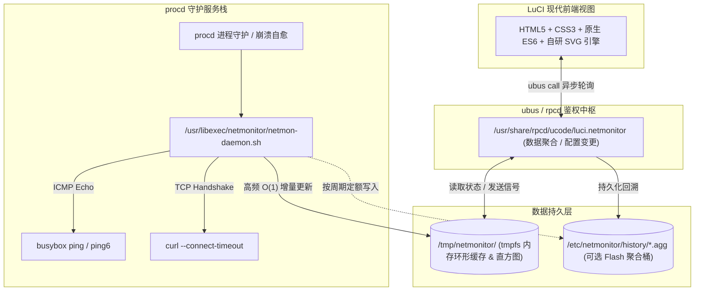

<div align="center">

# 🌐 luci-app-netmonitor

**面向 OpenWrt 主线（Mainline）的高性能网络延迟与连通性实时监控系统**

[](LICENSE)
[](CHANGELOG.md)
[](#-系统与版本兼容性)
[](#-系统架构)
[-lightgrey.svg?style=flat-square)](#-快速安装与验证)
[](https://github.com/LianXia233/luci-app-netmonitor/actions/workflows/build.yml)
[](#-测试与断言规范)
[-2e9e5b.svg?style=flat-square)](#-关键开发约定与工业级避坑指南)

*基于 procd 常驻守护进程与轻量 tmpfs 直方图存储 · 关闭网页后台持续采样 · 拒绝虚假 0ms 延迟*

---

</div>

## 📌 核心特性

- ⚡ **后台解耦常驻**：由 `procd` 托管单实例高并发检测守护进程，前台浏览器仅按需拉取渲染，关闭页面或多标签访问绝不造成探测任务冗余。
- 🎯 **双模精准探测**：支持 **ICMP Echo** 与 **TCP 三次握手**（逐目标自由指定）。在屏蔽 Ping 的复杂网络下，利用 TCP 握手测量真实时延。
- 📊 **硬核数据口径**：严谨区分超时、DNS 失败、网络不可达及协议异常；失败点延迟严格记为 `null`，绝不以 `0 ms` 伪造假象。
- 🧮 **轻量流式统计**：基于内存环形缓冲区与 17 桶直方图进行 $O(1)$ 增量计算，实时输出 P50 / P95 / P99 百分位分位数，CPU 消耗与历史长度彻底解耦。
- 🛡️ **Flash 零损耗设计**：高频点阵全量驻留 `/tmp`（tmpfs），仅可选开启低频聚合落盘；无磁盘写放大，保障路由器闪存寿命。
- 🎨 **自研动态矢量可视化**：内置 24 个动态响应式 SVG 状态仪表与多维度面积折线图，支持时间切片对齐 Tooltip 与丢包异常标记。

---

## 🧭 系统架构



> [!NOTE]
> **设计哲学**：前端视图刷新频率（默认 2s）与底层采样频率（默认 10s）彻底解耦，无论前端如何重载均不会发起多余的物理网络探测。

---

## 💻 系统与版本兼容性

| OpenWrt 发行版 / 分支 | 包管理工具 | 核心依赖状态 | 架构支持 |
| --- | --- | --- | --- |
| **OpenWrt 25.x / SNAPSHOT** | `apk` | `ucode`, `rpcd-mod-ucode`, `curl` | 全部 (`PKGARCH=all`) |
| **OpenWrt 24.10** | `opkg` | `ucode`, `rpcd-mod-ucode`, `curl` | 全部 (`PKGARCH=all`) |
| **OpenWrt 23.05** | `opkg` | `ucode`, `rpcd-mod-ucode`, `curl` | 全部 (`PKGARCH=all`) |
| **ImmortalWrt 23.05+** | `opkg` / `apk` | 同上 | 全部 (`PKGARCH=all`) |

---

## ⚡ 快速安装与验证

插件包架构为 `PKGARCH=all`，单份构建制品全架构通用（x86_64、aarch64、mips 等芯片均可直接安装）。

### 1. 包管理器部署

#### apk 系统（OpenWrt 25.x / ImmortalWrt SNAPSHOT）

```bash
apk update
apk add luci-app-netmonitor luci-i18n-netmonitor-zh-cn

# 离线本地安装：
# apk add --allow-untrusted luci-app-netmonitor_*.apk
```

#### opkg 系统（OpenWrt 23.05 / 24.10）

```bash
opkg update
opkg install luci-app-netmonitor luci-i18n-netmonitor-zh-cn

# 离线本地安装：
# opkg install --force-downgrade --force-depends luci-app-netmonitor_*.ipk
```

### 2. 服务启动与初始化

安装完成后，刷新 LuCI 缓存与 RPC 服务注册路由：

```bash
# 刷新 LuCI 路由缓存与 RPC 权限
rm -f /tmp/luci-indexcache*
/etc/init.d/rpcd restart
/etc/init.d/uhttpd restart

# 启用并拉起守护进程
/etc/init.d/netmonitor enable
/etc/init.d/netmonitor start
```

菜单入口位于：**状态（Status） → 网络质量监控（Network Monitor）**

### 3. 实机状态核验

```bash
# 1. 验证后台检测进程常驻
pgrep -f netmon-daemon

# 2. 验证 ubus RPC 命名空间注册
ubus list | grep luci.netmonitor

# 3. 检查心跳与实时指标链路（tick 随检测周期自增）
ubus call luci.netmonitor service_status
ubus call luci.netmonitor get_status
```

---

## ⚙️ UCI 配置规格 (`/etc/config/netmonitor`)

### 1. 全局配置段 (`config global`)

| 参数项 | 默认值 | 约束范围 | 说明 |
| --- | --- | --- | --- |
| `enabled` | `1` | `0` \| `1` | 监控总开关 |
| `interval` | `10` | `1 - 3600` (s) | 全局探测轮询间隔 |
| `timeout` | `3` | `1 - 30` (s) | 单次检测超时阈值 |
| `concurrency` | `5` | `1 - 50` | 并发执行探测的任务上限 |
| `address_family` | `auto` | `auto` \| `ipv4` \| `ipv6` | 全局地址族路由偏好 |
| `default_proto` | `icmp` | `icmp` \| `tcp` | 默认探测链路方式 |
| `default_tcp_port` | `80` | `1 - 65535` | TCP 探测未指明端口时的回退端口 |
| `persistence` | `0` | `0` \| `1` | Flash 聚合历史记录持久化（默认关闭以保护闪存） |
| `history` | `24h` | `1h` ~ `30d` | 持久化数据保留周期 |
| `persist_interval` | `300` | `60 - 3600` (s) | 聚合指标落盘 Flash 的周期 |
| `max_points` | `4320` | `100 - 86400` | 内存环形缓存深度（4320 点 @ 10s $\approx$ 12 小时） |
| `ui_refresh` | `2` | `1 - 60` (s) | Web 前端自动轮询状态的刷新周期 |
| `fail_warn` / `fail_critical` | `3` / `5` | 正整数 | 连续失败触发告警 / 严重告警的阈值 |
| `latency_excellent` ~ `poor` | `50`/`100`/`200`/`500` | 毫秒 (ms) | 延迟评级区间阈值（优秀/良好/一般/较差） |

### 2. 目标配置段 (`config target`)

```uci
config target 'baidu'
    option name      'Baidu'
    option host      'www.baidu.com'
    option region    'cn'          # 区域归类: cn | overseas | other
    option label     '搜索服务'     # 自定义标签
    option proto     'icmp'        # 探测方式: icmp | tcp
    option tcp_port  '0'           # 0 表示沿用全局 default_tcp_port
    option family    'auto'        # auto | ipv4 | ipv6 | both (目标级支持 both 双栈)
    option interval  '0'           # 局部覆盖: 0 表示继承全局
    option timeout   '3'           # 局部覆盖: 超时时长
    option interface ''            # 绑定出口网卡 (如 wan, wwan)
    option source    ''            # 绑定源 IP 地址
    option enabled   '1'           # 启停开关
    option remark    '核心业务检测'
```

---

## 🗄️ 存储机制与 Flash 寿命保护

| 层次 | 路径 | 存储介质 | 写入行为与生命周期 |
| --- | --- | --- | --- |
| **原始采样点** | `/tmp/netmonitor/ring/<id>.tsv` | tmpfs (RAM) | 每次探测追加单行，超出 `max_points` 循环覆盖 |
| **流式统计段** | `/tmp/netmonitor/hist/<id>.{cur,seg}` | tmpfs (RAM) | 每轮检测原地更新，仅保留 60 周期分段与 17 桶直方图 |
| **状态快照** | `/tmp/netmonitor/state/<id>` | tmpfs (RAM) | 极小文本，仅记录即时状态、错误码与连续计数 |
| **聚合历史桶** | `/etc/netmonitor/history/<id>.agg` | Flash (ROM) | 仅在 `persistence=1` 时，每隔 `persist_interval` 秒定额追加时序均值 |

> [!TIP]
> **算法复杂度保障**：P50 / P95 / P99 分位数采用直方图内插估算，单轮计算复杂度为严格的 $O(1)$，即便开启长周期连续监控，CPU 计算开销也绝不随时间推移而劣化。

---

## 📡 RPC 接口定义 (`luci.netmonitor`)

| 接口方法 | 鉴权 | 签名载荷要求 | 核心语义说明 |
| --- | --- | --- | --- |
| `get_status` | read | `{ "spark": bool }` | 获取全景运行态、各目标状态、区域聚合及迷你趋势图 |
| `get_statistics` | read | `{ "range": "1h" \| "24h" ... }` | 查询指定范围的汇总统计指标（极值、百分位、丢包率） |
| `get_history` | read | `{ "range": string, "target": string }` | 读取平滑降采样后的历史曲线时序点阵 |
| `set_config` | write | `{ "values": "..." }` | 严格基于白名单与类型范围写入全局配置 |
| `add_target` | write | `{ "target": "..." }` | 声明并校验新增监测目标 |
| `update_target` | write | `{ "id": string, "target": "..." }` | 更新目标参数（支持协议与端口动态变更） |
| `delete_target` | write | `{ "id": string }` | 移除目标及其内存关联数据文件 |
| `service_status` | read | `{}` | 查询底层 procd 服务运行态及心跳 `tick` 活跃度 |

---

## 🏗️ 编译与开发构建

### 1. 源码编译 (OpenWrt SDK)

```bash
# 1. 引入应用源码至 SDK package 目录
cp -r luci-app-netmonitor <sdk>/package/
./scripts/feeds update -a && ./scripts/feeds install -a

# 2. 配置并编译
make menuconfig # 路径: LuCI -> Applications -> luci-app-netmonitor
make package/luci-app-netmonitor/compile V=s
```

### 2. 核心源码拓扑

```text
luci-app-netmonitor/
├── Makefile                                        # 遵循主线规范的包构建定义
├── .github/workflows/build.yml                     # 静态审计 + 单元测试 + 构建流水线
├── po/                                             # 本地化多语言字典
│   ├── core_msgids.txt                             # 与核心语言包同名的 msgid 规范清单
│   ├── gen_po.py                                   # 跨平台 AST 翻译提取与冲突检测工具
│   └── zh_Hans/luci-app-netmonitor.po
├── tests/                                          # 自动化断言测试套件
│   ├── test_netmon_daemon.sh                       # 守护进程核心算法单元测试 (94 assertions)
│   └── test_icons.js                               # SVG 动态图标与渲染断言 (442 assertions)
├── root/                                           # 系统根预置资产
│   ├── etc/
│   │   ├── init.d/netmonitor                       # procd 进程托管脚本
│   │   └── uci-defaults/luci-app-netmonitor        # 首次安装初始化脚本
│   └── usr/
│       ├── libexec/netmonitor/netmon-daemon.sh     # 高并发检测核心引擎
│       └── share/
│           ├── luci/menu.d/                        # LuCI 菜单路由定义
│           └── rpcd/
│               ├── acl.d/                          # ACL 权限访问控制清单
│               └── ucode/luci.netmonitor           # ucode 高性能 RPC 服务端
└── htdocs/luci-static/resources/
    ├── netmonitor/
    │   ├── style.css                               # 限定于 .nm- 命名空间的自适应主题样式
    │   ├── common.js                               # RPC 数据格式化与异常处理中间层
    │   ├── chart.js                                # 自研轻量级 SVG 时序图表库
    │   └── icons.js                                # 24 个数据驱动内嵌 SVG 动态矢量图标
    └── view/netmonitor/                            # 纯客户端渲染单页视图
        ├── overview.js   realtime.js   charts.js
        ├── regions.js    history.js    targets.js  settings.js
```

---

## 🛠️ 关键开发约定与工业级避坑指南

### 1. rpcd ucode 参数传递规范

`rpcd-mod-ucode` 调用 ucode 时，第一个参数恒为 RPC 请求资源句柄，实际请求参数存放在 `request.args` 中。

* **参数类型陷阱**：直接传入数字或布尔字面量（如 `{"x": 1}`）会导致 RPC 返回 `Invalid argument`。
* **最佳实践**：前端传输一律序列化为字符串或逗号分隔列表（如 `"id1,id2"`），由后端 `split()` 处理。

### 2. LuCI 前端模块导出约束

LuCI 模块加载器强制执行类检查（`Class.isSubclass(_class)`），随后实例化注入。

* 工具模块统一使用 `return Class.extend({...});`。
* 严禁使用 `Class.singleton({...})`，其返回的静态实例会触发 `factory yields invalid constructor` 异常。

### 3. TSV 空字段塌陷灾难（POSIX IFS 陷阱）

由于 TAB 字符属于 IFS 空白字符，POSIX shell 下的 `read` 会无条件压缩合并连续的 TAB。

* 若 `iface` 或 `label` 字段留空，后续字段将整体左移，导致 `DNS` 标签被当成 `iface` 传给 ping，进而触发 `bad address` 假异常。
* **规避方案**：写入空字段时统一填充占位符 `-`，读取后解构还原，确保列宽恒定为 12 列。

### 4. CI 环境变量 `PKG_NAME` 污染构建矩阵

若工作流声明了全局环境变量 `PKG_NAME: luci-app-netmonitor`，OpenWrt 在执行 `include/scan.mk` 递归收集包信息时，该变量将无条件污染每个包的 `Makefile`。这会导致数百个包被强行改名为同一符号，引发海量循环依赖并最终抛出 `No rule to make target 'package/.../compile'`。

* **规避方案**：CI 全局变量统一加上专属前缀（如 `NM_PKG`），进入编译步骤前执行 `unset PKG_NAME`。

### 5. `BuildPackage` 宏文本签名约束

OpenWrt 包扫描机制通过 `grep -aHE 'call (Build/DefaultTargets|BuildPackage)'` 构建待编译包清单。如果你的 `Makefile` 纯靠动态 `include` 而未在文本中显式出现该签名，该包将被扫描器直接静默剔除。

* **规避方案**：必须在 `Makefile` 末尾保留标准注释行：`# call BuildPackage - OpenWrt buildroot signature`。

### 6. 多实例 Reload 并发冲突防护

当修改配置触发服务重启时，旧进程在超时等待退出期间可能与新启动的实例重叠。

* **规避方案**：运行期临时工作目录基于 PID 彻底隔离（`/tmp/netmonitor/tmp.$$`），目录清理逻辑仅针对已死亡进程，杜绝新旧实例读写文件竞态。

### 7. 原生 uci.apply 零变动 Code 5 报错

当未做任何表单变更直接点击提交时，底层 rpcd 的 `uci.apply` 会直接抛出 `ubus code 5: No data received`。

* **规避方案**：前端在提交前比对表单值与 `uci.get()`，若无改动则拦截并直接提示 `No changes to save`。

### 8. 表单 `data-nm-key` 冒泡绑定失效

为配置项打测试选择器标记时，若将 `data-nm-key` 同时挂载在容器 `div` 与内部 `input`，自动化测试选择器将命中外层 `div`，导致赋值操作仅更新了临时属性，底层的实际输入框未受任何影响。

* **规避方案**：标记必须独占绑定于表单实体控件（`input` / `select`）。

### 9. 长驻脚本原地 Reload 的变量缓存残留

`config_load` 机制仅导出当前存在的配置为 `CONFIG_*` 环境变量，但**不会清理上一轮已导出的被删字段**。长驻服务在原地执行重载后，仍会读取到已被删除字段的旧值。

* **规避方案**：执行 `config_load` 前必须用 `for v in $(set | ...)` 强制清空上下文中的所有 `CONFIG_*` 缓存。注意不得使用管道 `| while`，否则 `unset` 将仅作用于子 shell。

### 10. procd PIDFILE 所有权竞态

通过 `procd_set_param pidfile` 托管的文件必须交由 procd 负责全生命周期维护。若在 `stop_service()` 中手动 `rm` 该 PID 文件，将导致 procd 抛出 `Failed to remove pidfile: No such file or directory` 的假报错。

### 11. ucode 整除精度截断陷阱

ucode 内部区分 `int` 与 `double`。表达式 `((v * m + 0.5) | 0) / m` 中，由于按位或运算返回 `int`，两侧均为整型时除法将**直接转为截断整除**，导致小数位全部变为 0。

* **规避方案**：除数必须强制使用浮点字面量（如 `/ 100.0` 或 `/ (m * 1.0)`）。

### 12. Windows 开发环境 Git 文件权限遗失

Windows 默认 `core.filemode=false`，提交的代码会统统被固化为 `100644` 权限，导致安装到路由器上的 init 脚本因缺少可执行权限而启动失败。

* **规避方案**：通过 `git update-index --chmod=+x <file>` 针对关键脚本当且仅当修改 Git 索引位。

### 13. 本地化 LMO 核心词典冲突覆盖

LuCI 加载翻译时，`base.zh-cn.lmo` 的词频优先级高于插件。若插件自定义了 `Label`、`Uptime` 等通用短词，将被系统原生词条强行覆盖为“卷标”、“运行时间”。

* **规避方案**：插件专用文案换用明确长词（如 `Custom label`、`Availability`），避免与系统全局词条撞车。

### 14. 动态 SVG 动效与硬件加速原则

为确保在资源受限的嵌入式 SoC 上丝滑渲染，动效严禁使用高消耗的 `filter: blur` 与复杂的 `box-shadow`。统一借助 CSS `transform-box: fill-box` 将缩放旋转锚定于图形自身边界盒，确保仅调用合成层渲染，杜绝页面 Layout 重排。

---

## 🧪 测试与断言规范

项目在本地及 GitHub Actions CI 流水线中集成了多层自动化验证护栏：

```sh
# 1. 运行守护进程核心逻辑单元测试 (94 assertions)
# 涵盖: 异常错误分类、TSV 占位容错、分段直方图数学模型、TCP 握手判定
sh tests/test_netmon_daemon.sh

# 2. 运行 SVG 动态矢量图标自动化断言 (442 assertions)
# 涵盖: 零三方依赖、数据变化敏感性、空值边界防御、视口尺寸阈值
node tests/test_icons.js

# 3. 运行静态翻译完整性与 AST 代码冲突扫描
python3 po/gen_po.py --audit
```

---

## ⚖️ 许可证

本项目遵循 [GPL-3.0-or-later](LICENSE) 开源授权协议。

Copyright (C) 2026 netmonitor contributors
