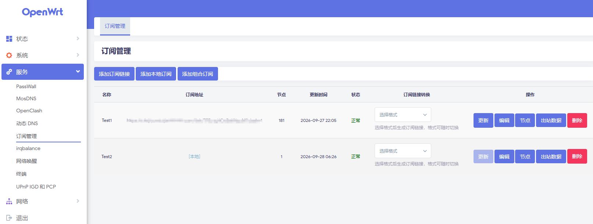

# luci-app-substore

**English** | [简体中文](README.md)

Native **OpenWrt / ImmortalWrt** LuCI application for managing airport / proxy
subscriptions. Parse nodes from a subscription, filter, deduplicate, rename and
group them, then re-emit them in a format your client can consume.



## Features

**Subscription management**
- Add / edit / delete / update multiple subscription sources
- Manual update plus per-subscription timed (cron) updates
- Status overview: node count, last update time, error message
- Remaining traffic & remaining duration per subscription, parsed from the
  `subscription-userinfo` response header (shown on the edit page only)
- **Subscription proxy**: download the subscription through an
  `http://` / `https://` / `socks4` / `socks5` / `socks5h` proxy — useful when the
  source is unreachable directly
- **Combination subscription**: merge an arbitrary subset of existing subscriptions
  (optionally with keyword include / exclude and dedup rules) into one combination that
  has its own name, token and subscription link; combinations are recomputed automatically
  when a source updates
- **Local subscription**: no URL needed — paste node text (mixed YAML / URI / JSON) or
  enter nodes one by one via a form whose fields adapt to the selected protocol
  (vmess / vless / ss / ssr / trojan / hysteria2 / tuic / wireguard / socks)

**Input parsing**
- Subscription formats: URI lists, Base64, JSON, Clash YAML, sing-box JSON,
  V2Ray / Xray JSON, Surge / Surfboard / Loon / Quantumult X configs, and LAN
  subscription links
- Node protocols: `vmess` / `vless` / `trojan` / `shadowsocks` / `ssr` / `hysteria2` /
  `tuic` / `socks` (and more)

**Node processing**
- Browse nodes, filter by group / protocol, keyword search, sort
- Node grouping: set a node's group inline in the Group column (saved via XHR without
  reload), filter via the Group dropdown
- Per-node edit / delete (Actions column); header checkbox selects all, then the Delete
  button batch-deletes the selection; the Refresh button reloads the list keeping the
  current filters
- Per-subscription rules applied on every update:
  - keyword include / exclude (comma-separated, multi-keyword)
  - deduplication

**Network probing** (Nodes page)
- Ping (ICMP latency), TCPing (connect latency), URL test (HTTP latency)
- Parallel probing, success count and average latency

**Conversion & output**
- Protocol conversion: any node type → any other type
- SSR (`ssr://`) input is re-emitted losslessly to SSR-capable clients only — Mihomo /
  Clash.Meta, Stash, Loon, Egern, Shadowrocket — and dropped for the rest (sing-box,
  V2Ray/Xray, Surge family), since SSR is not convertible to/from other protocols
- 13 output formats (all implemented): Plain JSON, Stash, Clash.Meta / Mihomo YAML,
  Surfboard, Surge, Surge Mac, Loon, Egern, Shadowrocket, Quantumult X, sing-box,
  V2Ray / Xray, V2Ray URI

**Subscription links**
- Per-subscription random token → public download endpoint
  `/substore/download?token=<token>&target=<format>` that Passwall / OpenClash and
  other clients can pull directly

**LuCI web UI & i18n**
- English by default, 简体中文 auto-selected when the runtime language is `zh-cn`

## Installation

> The version in the package name must match `PKG_VERSION` / `PKG_RELEASE` in the
> [Makefile](Makefile) (currently `2.2.0-r2`).

opkg (OpenWrt / ImmortalWrt 24.10 and earlier):

```bash
opkg install luci-app-substore-2.2.0-r2.ipk
```

apk (OpenWrt / ImmortalWrt 25.12+):

```bash
apk add --allow-untrusted luci-app-substore-2.2.0-r2.apk
```

Then open LuCI: **Services → Subscriptions**.

## Usage

1. **Add a subscription** — paste the subscription URL; optionally set up a
   per-subscription cron schedule, rules, or a download proxy. No remote source?
   Use **Add local subscription**: paste node text or enter nodes via the form.
2. **Update** — fetch, parse and filter the nodes.
3. **Browse nodes** — filter (group / protocol / keyword), sort, probe latency; tick
   checkboxes and hit Delete for batch deletion, edit / delete / regroup in-row, and
   Refresh reloads the list.
4. **Export** — pick one of the 13 output formats, or copy the subscription link
   to feed a downstream client (Passwall / OpenClash / …).

## Project layout

```
.
├── Makefile                      # OpenWrt package definition
├── LICENSE                       # GPL-2.0-or-later
├── root/                         # install payload
│   ├── etc/
│   │   ├── config/substore       # UCI placeholder
│   │   └── uci-defaults/99-substore
│   ├── usr/
│   │   ├── bin/substore-cron.sh  # per-subscription cron runner
│   │   ├── lib/lua/luci/
│   │   │   ├── controller/admin/substore.lua   # routes / actions
│   │   │   └── view/substore/*.htm             # templates
│   │   └── share/
│   │       ├── luci/menu.d/luci-app-substore.json
│   │       └── substore/*.lua    # core logic (no luci.* dependency)
├── po/zh-cn/substore.po          # 简体中文 translations
├── docs/                         # design & guides
└── tests/                        # self-contained Lua 5.1 unit tests
```

## Documentation

- [docs/ARCHITECTURE.md](docs/ARCHITECTURE.md) — architecture design
- [docs/PLAN.md](docs/PLAN.md) — staged development plan
- [docs/BUILD.md](docs/BUILD.md) — building from an OpenWrt SDK/source tree
- [docs/INSTALL.md](docs/INSTALL.md) — installation
- [docs/SECURITY.md](docs/SECURITY.md) — security model
- [docs/TESTING.md](docs/TESTING.md) — testing
- [docs/UCODE_MIGRATION.md](docs/UCODE_MIGRATION.md) — `.htm` → `.ut` (ucode) migration notes
- [CHANGELOG.md](CHANGELOG.md) — changelog

## Building

Place the package under an OpenWrt / ImmortalWrt SDK or source tree matching the
target firmware, then:

```bash
cp -r luci-app-substore <openwrt-tree>/package/
make package/luci-app-substore/compile V=s
```

The `.ipk` (or `.apk` on apk builds) is produced under `bin/packages/.../`.

## Development & testing

The core is plain Lua 5.1 with no `luci.*` dependency, so it is unit-testable
without a device. Each file under `tests/` is self-contained:

```bash
lua5.1 tests/run_tests.lua          # or any single test file
for f in tests/*.lua; do lua5.1 "$f" || exit 1; done
```

Target-device verification is required for the LuCI UI and cron behaviour — see
[docs/TESTING.md](docs/TESTING.md).

## Security

SSRF protection (private / reserved / link-local ranges rejected), protocol
whitelisting, response size & timeout limits, command-injection defence
(whitelisted parsing + shell quoting), token-based access control on the public
download endpoint, and no credentials in logs. See
[docs/SECURITY.md](docs/SECURITY.md).

## License

[GPL-2.0-or-later](LICENSE) — see the [LICENSE](LICENSE) file.