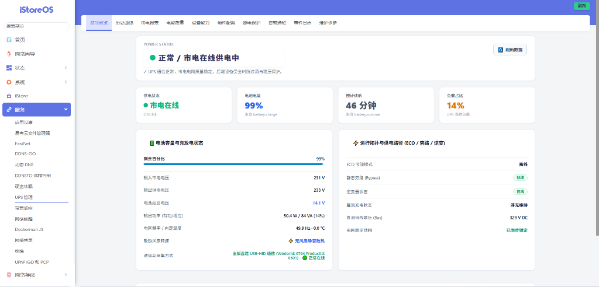
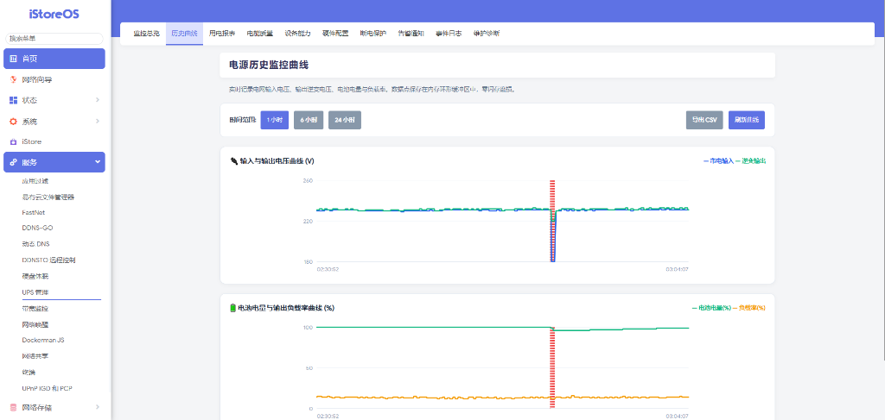
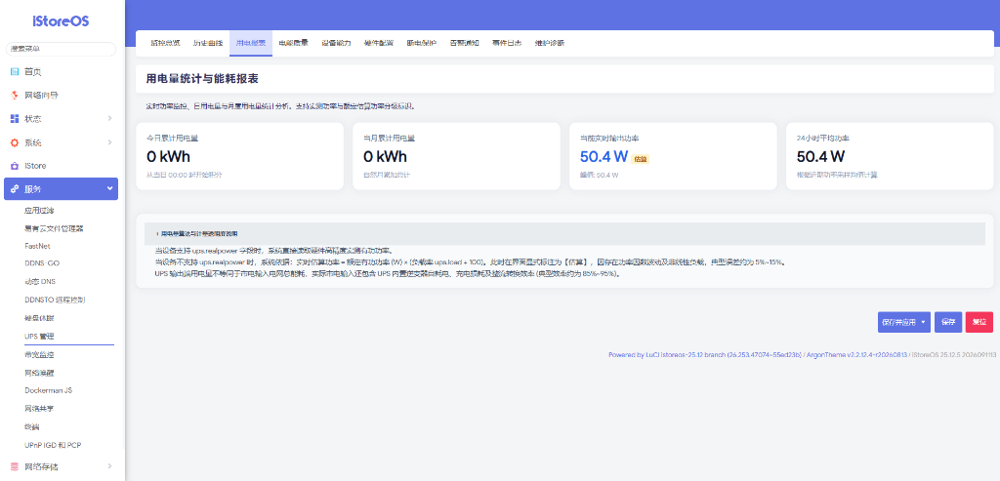
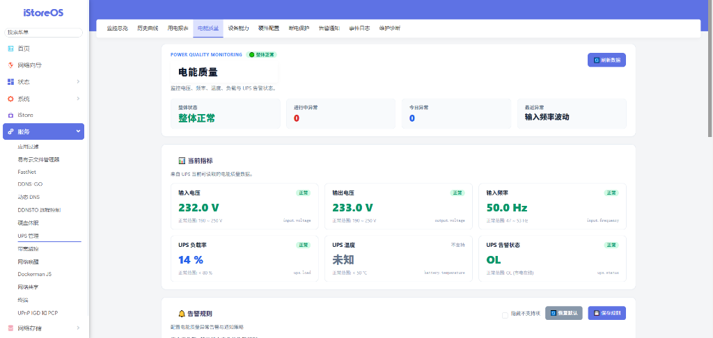
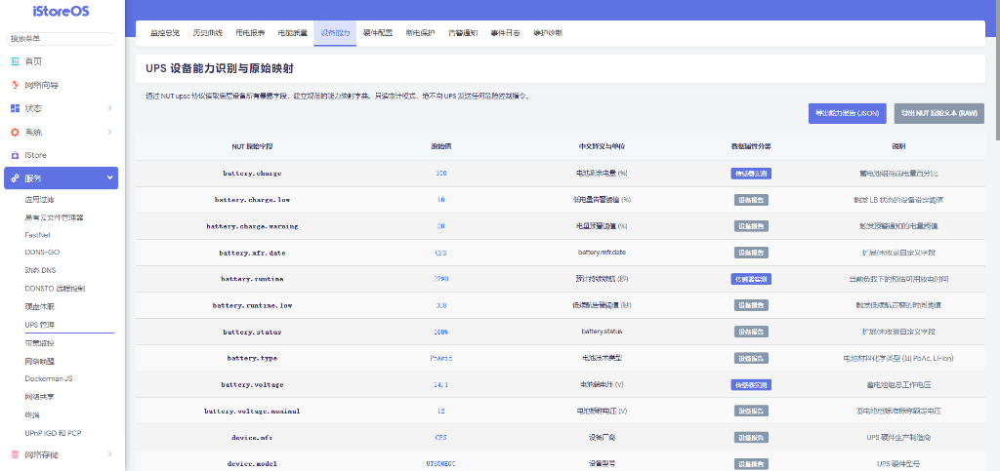
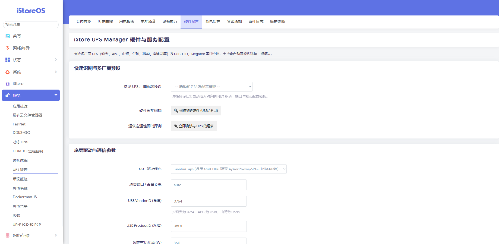
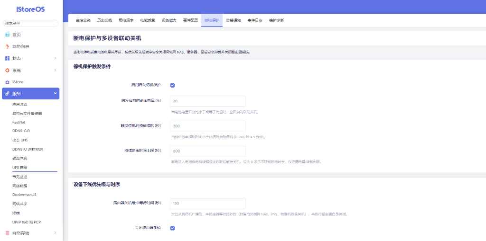
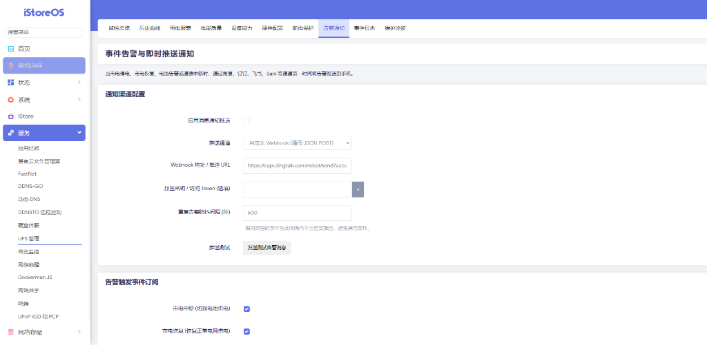
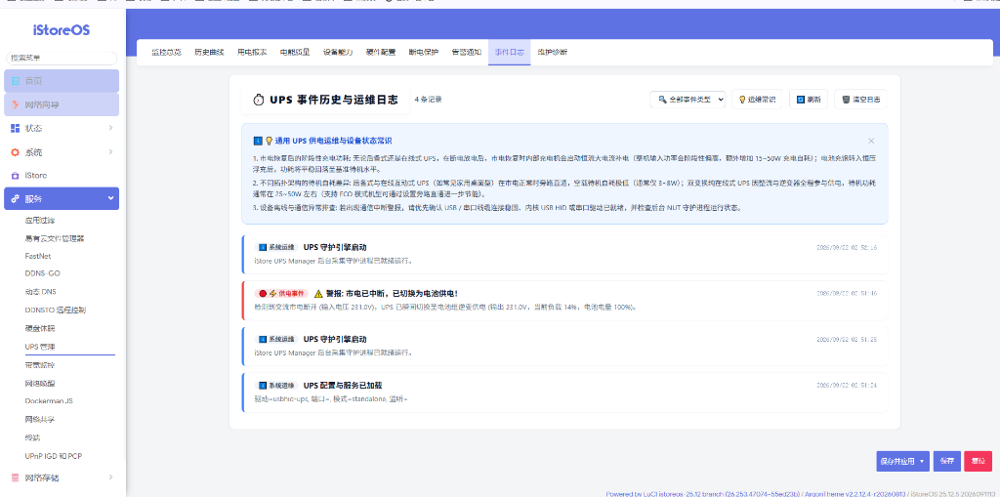
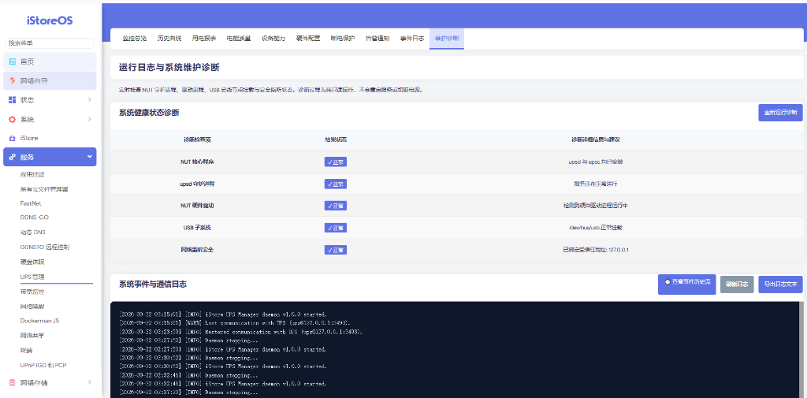

# UPS Manager (v1.0.1)

[](LICENSE)
[](https://openwrt.org)
[](https://istoreos.com)

**UPS Manager (`luci-app-ups-manager`)** 是一套专为 **OpenWrt** 及 **iStoreOS** 打造的企业级、高颜值、易用安全的现代化 UPS 电源管理系统。

深度适配 iStoreOS 软件中心与 LuCI 2.0+ 客户端渲染 JavaScript SPA 架构，底层无缝结合工业级开源驱动项目 NUT (Network UPS Tools)，为家庭软路由、轻 NAS、All-in-One 主机及企业边缘机房提供全方位的供电保障、能耗计量、历史追溯与智能多机联动断电防护。

---

## 📥 软件包下载 (Downloads)

> 💡 **提示**：如果您使用的是 **iStoreOS**，推荐直接在 **iStore 软件中心** 搜索安装。  
> 若需手动离线安装，可在此直接下载最新 **v1.0.1** 正式版安装包：

| 安装包类型 | 文件名 | 适用固件版本 | 下载直链 |
| :--- | :--- | :--- | :--- |
| **APK (新版)** | `luci-app-ups-manager-1.0.1-r1.apk` | OpenWrt 25+ / iStoreOS (apk版) | [⬇️ **立即下载 APK**](https://github.com/liuyuhao1023/luci-app-ups-manager/releases/download/v1.0.1/luci-app-ups-manager-1.0.1-r1.apk) |
| **IPK (传统)** | `luci-app-ups-manager_1.0.1_all.ipk` | OpenWrt 21/22/23/24 / 传统 opkg 系统 | [⬇️ **立即下载 IPK**](https://github.com/liuyuhao1023/luci-app-ups-manager/releases/download/v1.0.1/luci-app-ups-manager_1.0.1_all.ipk) |

👉 **完整版本发布页**：[GitHub Releases (v1.0.1)](https://github.com/liuyuhao1023/luci-app-ups-manager/releases/tag/v1.0.1)

---

## 📸 界面预览 (UI Showcase)

### 1. 监控总览仪表盘 (Overview Dashboard)
> 实时供电拓扑路径、电池电量续航、母线高压、逆变状态、负载实时功耗与直连通信通道全状态掌控。


### 2. 电源历史监控曲线 (Historical Curves)
> 原生 SVG 零依赖时序渲染，市电输入与逆变输出电压同屏比对，异常断电事件红虚线精准标定。


### 3. 用电量统计与能耗报表 (Energy & Power Telemetry)
> 累计电量统计、实时有功功率精准计量与估算分级标注，电费与能耗核算清晰明了。


### 4. 电能质量与智能告警 (Power Quality & Outage Guards)
> 输入/输出电压、频率稳频波动分析、防抖滞回引擎与全方位阈值告警。


### 5. UPS 硬件设备能力全景映射 (Hardware Capability Map)
> 自动探测并结构化映射硬件底层所有传感器与报告字段，只读安全审计，支持一键导出 JSON / 文本。


### 6. 硬件多厂商识别与参数配置 (Hardware & Driver Settings)
> 预置主流厂商签名库，支持 USB/串口设备一键物理扫描与通信连通性即时探测。


### 7. 断电保护与多设备联动关机 (Outage Protection & Device Shutdown)
> 停机保护触发条件（剩余电量、预估续航、断电时长），设备下线优先级与多机安全缓冲时序。


### 8. 事件告警与即时推送通知 (Notification & Alert Webhooks)
> 支持企微、钉钉、飞书、Bark、自定义 Webhook 等多种推送通道，内置告警防抖与脱敏保护。


### 9. UPS 事件历史与真实运维日志 (Event Log & Telemetry Audit)
> 实时记录供电事件（市电中断、电池供电、市电恢复等），内置通用 UPS 运维常识与分类筛选。


### 10. 运行日志与系统维护诊断 (Diagnosis & Health Check)
> 实时自检 NUT 核心程序、upsd、硬件驱动、USB 子系统与监听安全，查看实时通信日志流。


---

## 🌟 核心特性

1. **硬件智能识别与自动匹配**
   - 自动扫描物理总线，智能枚举 USB 及串口设备；
   - 识别 VendorID (VID)、ProductID (PID)、序列号及设备描述；
   - 预置海量 UPS 品牌签名库（CyberPower、APC、山特 Santak、科华 Kehua、伊顿 Eaton、Powercom 等），一键推荐并填入最优 NUT 驱动。
2. **极速高颜值监控大屏 (LuCI JS SPA)**
   - 纯客户端渲染，秒级打开，完美自适应手机、平板及桌面宽屏；
   - 深度兼容 Argon 主题与深浅色模式无缝自适应；
   - 实时总览：电网状态、电池电量进度环、持续续航时间、输出负载率、实时功率、输入/输出电压与工频、机内温度及通信状态。
3. **真实性原则与防虚构设计**
   - 严格根据设备硬件底层报告字段展示，不支持的项目明确标注为【不支持/未提供】，严禁臆测伪造数据；
   - 真实功率与估算功率（额定功率 × 负载率）清晰分级标注，明确提示算法依据与可能误差。
4. **历史数据曲线与时序可视化**
   - 采用零依赖原生 SVG 高性能渲染引擎，平滑顺畅；
   - 支持 1小时、6小时、24小时跨度切换与全量时序数据 CSV 导出；
   - 市电断电故障事件红线高亮标记，故障溯源一目了然。
5. **电能质量检测与防抖滞回引擎**
   - 电压过压、欠压告警及可配置滞回回差（Hysteresis），杜绝市电临界波动反复报警；
   - 电网工频偏离与机内过温告警监控。
6. **设备能力全景识别 (Read-Only Capability Map)**
   - 全量映射 `upsc` 原始通信字段，提供人性化中文释义、工程单位及分类（实测/报告/系统）；
   - 支持一键导出原始数据文本与 JSON 审计报告；
   - 只读审计设计，识别阶段严禁执行危险控制命令。
7. **零闪存磨损存储架构 (Flash Anti-Wear Architecture)**
   - 针对嵌入式路由器 Flash 特性深度优化，高频监控采样点仅驻留在内存环形队列（`/tmp/run` tmpfs）；
   - 严禁每 3 秒向 Flash 写入，历史统计采取低频定周期压缩持久化，最大程度延长路由器存储颗粒寿命。
8. **多机联动安全停机与分级策略**
   - 满足断电时间、剩余电量或低续航阈值时触发自动保护；
   - 关机优先级机制：优先向局域网 NAS、PVE、物理机发送安全下线指令，确保存储安全刷盘后再关闭路由器系统；
   - 市电恢复可逆中止保护；
   - 危险控制（如关闭 UPS 逆变输出）具备二次防误触保护。
9. **多渠道智能告警推送**
   - 原生支持：**企业微信机器人**、**钉钉自定义机器人**、**飞书机器人**、**Bark (iOS)**、**Server酱** 及 **通用 Webhook**；
   - 支持断电、市电恢复、电池告急、过载及通信故障通知；
   - 访问令牌与密钥输入框脱敏遮蔽保护，内置通知防抖限频机制。
10. **一键系统诊断工具箱**
    - 快速自检 NUT 核心程序、守护进程状态、驱动活性、USB 总线节点挂载及网络监听安全等级。

---

## 📦 架构与目录规范

```text
luci-app-ups-manager/
├── Makefile                               # OpenWrt 编译安装规则
├── app.json                               # iStoreOS 软件中心应用元数据
├── icon.png                               # 软件中心高分辨率应用图标
├── LICENSE                                # 开源许可证 (GPL-2.0)
├── README.md                              # 项目使用与技术说明文档
├── root/                                  # 系统目标落地文件
│   ├── etc/
│   │   ├── config/ups_manager              # UCI 配置文件
│   │   ├── init.d/ups-manager              # procd 系统服务脚本
│   │   └── uci-defaults/80_ups_manager     # 首次安装配置初始化
│   └── usr/
│       ├── bin/
│       │   ├── ups-manager-daemon          # 后台状态轮询、防抖与环形缓存守护
│       │   ├── ups-manager-notify          # 多通道告警推送调度器
│       │   └── ups-manager-shutdown        # 多设备联动停机协调器
│       ├── libexec/rpcd/luci.ups-manager   # ubus / rpcd 专用后端接口实现
│       └── share/
│           ├── acl.d/luci-app-ups-manager.json     # LuCI 权限访问清单
│           └── luci/menu.d/luci-app-ups-manager.json # LuCI 多级导航菜单
└── htdocs/luci-static/resources/view/ups-manager/
    ├── overview.js                        # 监控总览仪表盘
    ├── charts.js                          # 历史数据可视化曲线
    ├── energy.js                          # 用电量与能耗报表
    ├── quality.js                         # 电能质量检测配置
    ├── capability.js                      # 设备能力识别与原始映射
    ├── settings.js                        # 硬件扫描与基础设置
    ├── shutdown.js                        # 断电保护与联动停机
    ├── notification.js                    # 消息通知与测试推送
    └── diagnosis.js                       # 系统维护诊断与事件日志
```

---

## 🛠️ 安装与部署指南

### 🔥 最简推荐：一键在线全自动安装
在路由器 SSH 终端中直接粘贴执行以下单行命令，脚本将自动识别 `apk` 或 `opkg` 并完成全部依赖与插件的安装与启动：

```bash
curl -sL https://raw.githubusercontent.com/liuyuhao1023/luci-app-ups-manager/main/install.sh | sh
```

---

### 方法二：通过 iStoreOS 软件中心一键安装（推荐）
1. 登录 iStoreOS 后台，打开 **iStore 软件中心**；
2. 搜索 `UPS Manager` 或 `ups-manager`；
3. 点击 **安装**，软件中心将自动安装所需 NUT 驱动并完成系统集成；
4. 进入 **服务** -> **UPS 管理** 开始使用。

### 方法二：通过命令行手动安装 (opkg / apk)

#### 1. 针对标准 OpenWrt / iStoreOS (使用 opkg)
```bash
# 更新软件源
opkg update

# 安装核心依赖
opkg install nut nut-common nut-server nut-upsmon nut-upsc nut-driver-usbhid-ups curl

# 下载并安装本插件
wget https://github.com/liuyuhao1023/luci-app-ups-manager/releases/download/v1.0.1/luci-app-ups-manager_1.0.1_all.ipk
opkg install luci-app-ups-manager_1.0.1_all.ipk
```

#### 2. 针对基于 apk 包管理的新版 OpenWrt / iStoreOS
```bash
apk update
apk add nut-server nut-upsmon nut-upsc nut-driver-usbhid-ups curl

# 下载并安装本插件
wget https://github.com/liuyuhao1023/luci-app-ups-manager/releases/download/v1.0.1/luci-app-ups-manager-1.0.1-r1.apk
apk add --allow-untrusted luci-app-ups-manager-1.0.1-r1.apk
```

---

## 🔨 从源码编译

将本仓库克隆至 OpenWrt 源码根目录下的 `package` 目录中：

```bash
cd /path/to/openwrt/package/
git clone https://github.com/liuyuhao1023/luci-app-ups-manager.git

# 在 menuconfig 中选中
make menuconfig
# 导航路径: LuCI -> 3. Applications -> luci-app-ups-manager -> 选择 <*>

# 编译单独包
make package/luci-app-ups-manager/compile V=s
```

编译生成的 `.ipk` 文件将位于 `bin/packages/<架构>/base/` 或 `bin/packages/<架构>/luci/`。

---

## 🔒 安全性与免责声明

1. **默认网络安全限制**：NUT 服务默认仅绑定本地 `127.0.0.1`，严禁在未经内网安全隔离的情况下直接暴露在 `0.0.0.0` 或公网 WAN 端口。
2. **硬件断电控制防误触**：关闭 UPS 负载输出属于高危操作。如果市电在此时恰好恢复，部分 UPS 可能会处于断电保护锁定状态，需要现场人工按键冷启动。请务必在充分理解后果并在家庭/机房环境充分测试后再决定是否开启。

---

## 📄 开源许可证

本项目基于 [GNU General Public License v2.0](LICENSE) 开源发布。
欢迎提交 Issue 和 Pull Request 共同改进！
